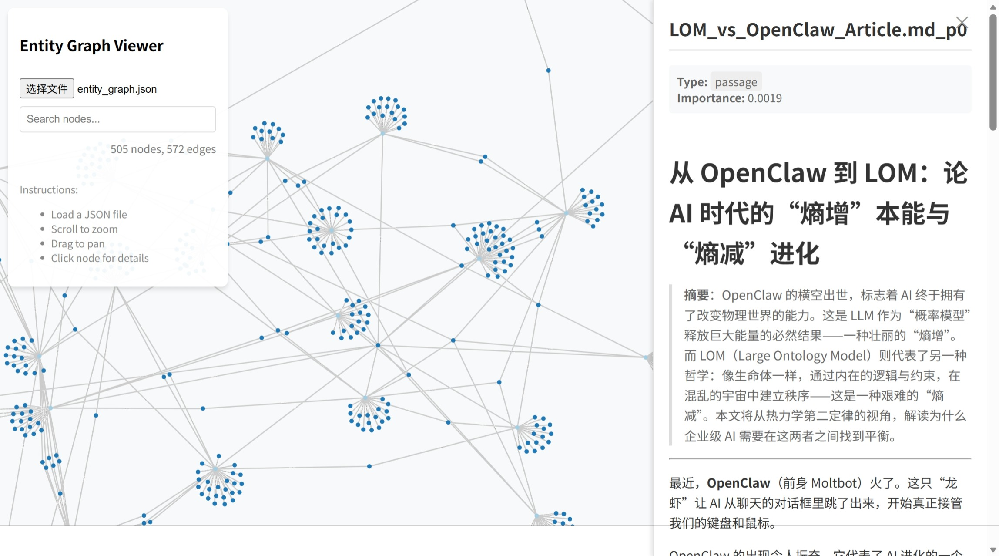

# 🧠 Infinite Context Graph

> 把几百个文档/笔记扔进去，自动找出：哪些概念最核心、哪些内容互相关联、整个知识库里真正重要的是什么。
>
> 用 LLM 抽取实体 · PageRank 计算重要性 · 浏览器直接查看图谱

  

---

## 它解决什么问题

你有几百个 Markdown 文档——研究笔记、会议记录、知识库、读书摘要——但你不知道：

- 整个文档库里**真正核心的概念**是哪些
- **哪些内容在互相引用**、形成了知识集群
- 某个人名/事件/概念**在哪些文档里出现过**

搜索解决不了这个问题，因为你不知道该搜什么。大模型读不了这么多文档，因为上下文窗口有限。

这个工具的思路是：**不把文档塞给模型，而是用模型从文档里提炼出实体关系，然后用图来承载和计算**。

---

## 它怎么工作

```
你的 Markdown 文件夹
        ↓
   按 token 切片为 passages
        ↓
   LLM 从每个 passage 抽取核心实体
  （人、地点、组织、事件、关键概念）
        ↓
   构建 Passage → Entity 有向图
        ↓
   PageRank 计算每个节点的重要性
        ↓
   导出 JSON + 浏览器交互可视化
```

结果：你能看到整个文档库里**哪些实体最重要**，以及它们和哪些文档、哪些其他实体相关联。



---

## 快速开始

**环境：Python 3.10+，一个 OpenAI 兼容的 API Key**

```bash
git clone https://github.com/liftkkkk/infinite-context-graph
cd infinite-context-graph
pip install -r requirements.txt
pip install pydantic
```

**配置 API Key**

在项目根目录创建 `.env` 文件：

```
OPENAI_API_KEY=你的key
```

默认使用 [SiliconFlow](https://siliconflow.cn) 的 API（国内可用，有免费额度），模型为 `Qwen/Qwen3-8B`。如需换成 OpenAI 或其他兼容接口，修改 `run.py` 顶部的 `BASE_URL` 和 `MODEL_NAME` 即可。

**准备你的文档**

把 Markdown 文件放到 `data/` 目录下：

```
data/
├── 研究笔记.md
├── 会议记录.md
└── 读书摘要/
    └── ...
```

**运行**

```bash
python run.py
```

运行完成后会生成 `entity_graph.json`。用浏览器打开 `graph_viewer.html`，选择这个 JSON 文件，即可查看图谱。

---

## 图谱查看器功能

打开 `graph_viewer.html` 后：

- **搜索节点** — 直接输入实体名或关键词定位
- **点击节点** — Passage 节点显示原文片段，Entity 节点显示关联文档
- **节点大小 = 重要性** — PageRank 分数越高，节点越大，代表在整个知识库中越核心
- **缩放/拖拽** — 自由探索整张图

---

## 适合什么场景

| 场景 | 说明 |
|------|------|
| 个人知识库 | Obsidian / Notion 导出的大量笔记，找出知识核心 |
| 研究文献整理 | 几十篇论文的阅读笔记，发现高频概念和关联 |
| 项目文档分析 | 代码库的文档、Wiki，快速理解架构和关键概念 |
| 竞品/行业研究 | 大量行研报告，提炼核心实体和关系 |
| 企业知识管理 | 内部文档库，自动构建知识图谱 |

---

## 配置说明

`run.py` 顶部可以调整的配置项：

```python
BASE_URL    = "https://api.siliconflow.cn"  # API 地址
MODEL_NAME  = "Qwen/Qwen3-8B"              # 模型名称
CHUNK_TOKENS = 512                          # 每个 passage 的 token 上限
MAX_ENTITIES = 8                            # 每个 passage 最多抽取几个实体
```

**关于 tokenizer：** `chunk.py` 需要本地 tokenizer 对文本切片。推荐使用 Qwen 系列的本地模型，或直接替换为 `tiktoken`（OpenAI 系）。详见代码注释。

---

## 项目结构

```
infinite-context-graph/
├── run.py              # 主流程：扫描 → 切片 → 抽取 → 建图 → 导出
├── chunk.py            # 按 token 数切片
├── count_graph.py      # 命令行查看图谱统计（节点数、Top 实体）
├── graph_viewer.html   # 浏览器图谱查看器
├── requirements.txt
└── data/               # 放你的 Markdown 文件
```

---

## 与 GraphRAG 的区别

微软的 [GraphRAG](https://github.com/microsoft/graphrag) 也做类似的事，但：

- GraphRAG 是完整的 RAG 检索系统，配置复杂，依赖多
- 本项目只做一件事：**把文档变成可视化的实体图**，轻量、可本地运行、图谱导出即用
- 适合想快速理解文档库结构、不需要接入问答系统的场景

---

## Roadmap

- [ ] 支持 PDF / TXT / HTML 输入格式
- [ ] Entity → Entity 关系抽取（不只是 Passage → Entity）
- [ ] 增量更新（新文档加入不需要重跑全量）
- [ ] 导出为 Neo4j / NetworkX 格式

---

## License

MIT — 随便用，欢迎 PR 和 Issue。

如果这个工具帮你整理了知识库，欢迎给个 ⭐
